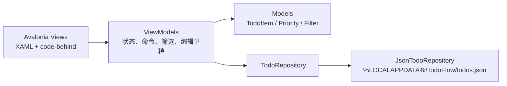

# TodoFlow

一个使用 **Avalonia UI 11 + .NET 8** 实现的桌面 Todo List 应用。

## 已实现功能

- 新建待办：标题、备注、优先级、截止日期。
- 修改待办：右侧详情面板编辑，保存前使用独立草稿，支持取消。
- 完成任务：复选框即时切换状态。
- 删除任务：支持单项删除和批量清除已完成任务。
- 筛选任务：全部、进行中、已完成。
- 搜索任务：按标题或备注实时过滤。
- 统计进度：显示进行中数量、已完成数量和完成百分比。
- 自动持久化：任务保存在本地 JSON 文件，采用临时文件替换方式避免写入中断损坏正式文件。
- 空状态与错误状态：无数据、无匹配结果、保存失败都有明确提示。

## 为什么选择 Todo List

相比依赖第三方在线服务的天气应用，Todo List 可以做到：

1. **功能闭环**：新增、读取、更新、删除、筛选、统计、持久化全部可独立完成。
2. **离线可用**：不依赖 API Key、网络和第三方服务稳定性。
3. **架构展示完整**：同时覆盖 UI 绑定、命令、状态派生、异步 I/O 和数据序列化。
4. **便于扩展**：后续可以自然增加分类、子任务、提醒、云同步或数据库存储。

## 运行环境

- .NET 8 SDK
- Windows、macOS 或 Linux 桌面环境

## 运行

```powershell
dotnet restore .\TodoFlow.sln
dotnet run --project .\src\TodoFlow\TodoFlow.csproj
```

也可以直接使用 Visual Studio 2022 或 Rider 打开 `TodoFlow.sln`。

## 发布 Windows 单文件版本

```powershell
dotnet publish .\src\TodoFlow\TodoFlow.csproj `
  -c Release `
  -r win-x64 `
  --self-contained true `
  -p:PublishSingleFile=true
```

生成文件位于 `src\TodoFlow\bin\Release\net8.0\win-x64\publish`。

## 数据位置

默认保存到：

```text
%LOCALAPPDATA%\TodoFlow\todos.json
```

数据文件使用 CamelCase JSON 和字符串枚举，便于查看与迁移。

## 项目结构

```text
TodoFlow.sln
src/TodoFlow/
├─ Models/            领域数据模型
├─ Infrastructure/    本地 JSON 仓储
├─ ViewModels/        页面状态、命令、筛选、编辑草稿和统计
├─ Views/             Avalonia 窗口与 XAML 布局
├─ App.axaml          全局主题、颜色和控件样式
└─ Program.cs         Avalonia 启动入口
docs/ARCHITECTURE.md  架构设计说明
```

## 架构概览



核心原则：

- View 只负责显示和输入，不直接读写文件。
- ViewModel 负责交互逻辑、派生状态和持久化协调。
- Repository 隔离存储方式，未来切换到 SQLite 或云同步时不需要改界面。
- Model 保持简单，负责可序列化的领域数据。
- 编辑时使用 `TodoItemEditorViewModel` 草稿，取消不会污染原任务。

更完整的设计说明见 [docs/ARCHITECTURE.md](docs/ARCHITECTURE.md)。

## 验证状态

项目已完成文件结构、XAML XML、C# 基本结构和绑定契约的静态检查。当前生成环境的 .NET 安装缺少 SDK 且网络下载受系统凭据策略阻断，因此未在本机执行 `dotnet build`；安装 .NET 8 SDK 后可直接通过上述命令还原并构建。